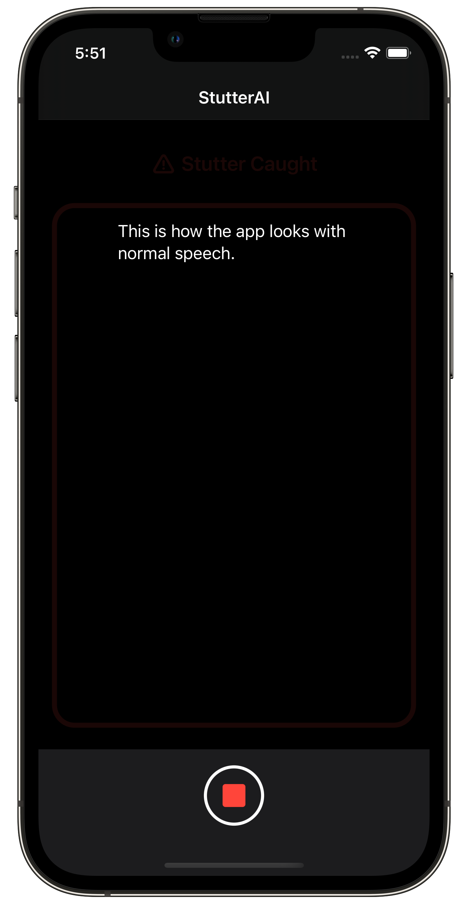
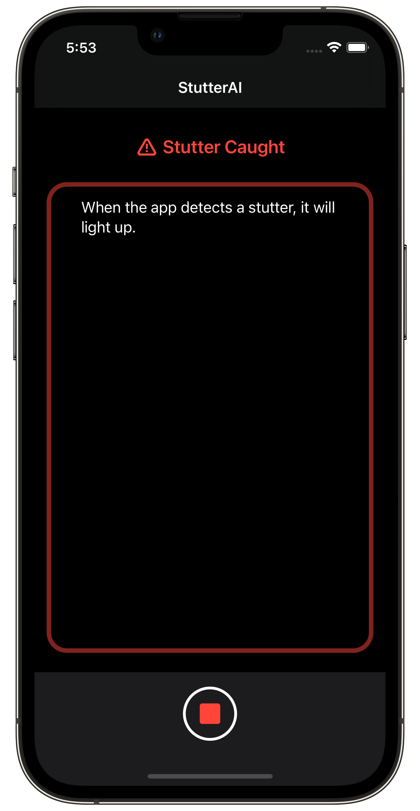

# StutterAI

StutterAI is an app that uses a machine learning algorithm to detect a stutter. Along with voice recognition, it will actively run a ML model trained with Apple's Sep-28k dataset to check for stutters. The Sep-28k dataset can be found <a href="https://machinelearning.apple.com/research/stuttering-event-detection">here</a>.

StutterAI uses a machine learning model trained with Apple's Sep-28k dataset alongside Apple’s built-in voice recognition to display spoken text in real time, and show exactly when a stutter occurs. It is trained with all types of stuttering, and attempts to classify the kind of stuttering that occurs. The app only has one main page, which includes a record button to activate and deactivate voice detection.
